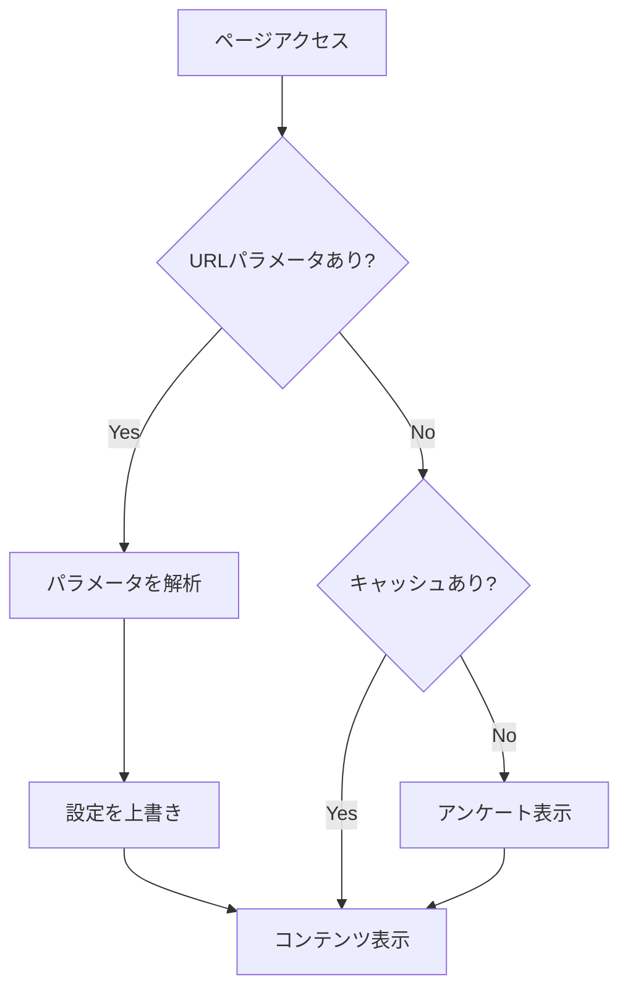

# URLパラメータ詳細ガイド

## 📌 概要

`/rebooters` ページでは、URLパラメータを使用して初回アンケートをスキップしたり、特定の設定で開始することができます。これにより、マーケティングキャンペーン、デモンストレーション、開発テストなど、様々なシナリオに対応できます。

**重要**: URLパラメータは常にLocalStorageのキャッシュより優先されます。

## 🎯 主な用途

1. **マーケティングキャンペーン**: ターゲット層に合わせたプリセットでランディング
2. **デモンストレーション**: プレゼン用に事前設定された状態で開始
3. **開発・テスト**: アンケートをスキップして効率的にテスト
4. **パーソナライゼーション**: メールマーケティング等で個人名を含むリンク配布

## 📝 パラメータ一覧

### 基本パラメータ

| パラメータ | 値 | 説明 | デフォルト |
|-----------|-----|------|-----------|
| `skip` | `true` | アンケートをスキップ | なし |
| `preset` | 下記参照 | プリセット設定を適用 | なし |
| `name` | 文字列 | ユーザー名を設定 | "あなた" |
| `music` | `play` / `mute` | BGM設定 | `play` |

### プリセット値

| プリセット | 説明 | 設定内容 |
|-----------|------|----------|
| `efficiency` | 効率重視 | • 期待: 効率性重視<br>• 感情: 変化への適応<br>• フォーカス: スキル習得<br>• BGM: reboot_1.mp3 |
| `possibility` | 可能性重視 | • 期待: 可能性の探求<br>• 感情: 成長への欲求<br>• フォーカス: マインドセット変革<br>• BGM: reboot.mp3 |
| `debug` | デバッグ用 | • ユーザー名: "デバッグユーザー"<br>• BGM: ミュート<br>• 効率重視の設定 |

## 🚀 使用例

### 1. 基本的な使用例

#### アンケートをスキップ（デフォルト設定）
```
https://example.com/rebooters?skip=true
```
- 名前: "あなた"
- 設定: 可能性重視（デフォルト）
- BGM: 再生

#### 名前を指定してスキップ
```
https://example.com/rebooters?skip=true&name=太郎
```
- 名前: "太郎"
- 設定: 可能性重視（デフォルト）
- BGM: 再生

### 2. プリセット使用例

#### 効率重視のビジネスパーソン向け
```
https://example.com/rebooters?preset=efficiency
```
- 名前: "あなた"
- 設定: 効率重視
- BGM: reboot_1.mp3（集中力を高めるBGM）

#### 成長志向のクリエイター向け
```
https://example.com/rebooters?preset=possibility&name=クリエイター
```
- 名前: "クリエイター"
- 設定: 可能性重視
- BGM: reboot.mp3（没入感のあるBGM）

### 3. カスタマイズ例

#### フルカスタマイズ
```
https://example.com/rebooters?skip=true&name=山田太郎&music=mute
```
- 名前: "山田太郎"
- 設定: デフォルト（可能性重視）
- BGM: ミュート

#### プレゼンテーション用
```
https://example.com/rebooters?preset=efficiency&music=mute&name=デモユーザー
```
- 名前: "デモユーザー"
- 設定: 効率重視
- BGM: ミュート（プレゼンに配慮）

### 4. 開発・デバッグ用

#### デバッグモード
```
https://example.com/rebooters?preset=debug
```
- 全自動設定でアンケートを完全スキップ
- 開発時の動作確認に最適

## 🔧 技術仕様

### URLエンコーディング

日本語や特殊文字を含むパラメータは必ずURLエンコードしてください。

#### JavaScript例
```javascript
const name = "山田太郎";
const encodedName = encodeURIComponent(name);
const url = `https://example.com/rebooters?name=${encodedName}`;
// 結果: https://example.com/rebooters?name=%E5%B1%B1%E7%94%B0%E5%A4%AA%E9%83%8E
```

#### PHP例
```php
$name = "山田太郎";
$url = "https://example.com/rebooters?name=" . urlencode($name);
```

### 優先順位

1. **URLパラメータ** （最優先）
2. LocalStorageのキャッシュデータ
3. デフォルト値

**注意**: URLパラメータが指定されている場合、既存のキャッシュデータは上書きされます。

### 初回設定のやり直し

「初回設定をやり直す」ボタンを押すと：

1. LocalStorageのデータがクリアされます
2. **URLパラメータも自動的に削除されます**
3. クリーンな状態でページがリロードされます

これにより、URLパラメータによる強制設定を回避し、真っ新な状態から始めることができます。

### 処理フロー



## 💡 活用シナリオ

### 1. マーケティングキャンペーン

#### Facebook広告からの流入
```
# 効率重視の訴求
https://example.com/rebooters?preset=efficiency&utm_source=facebook&utm_campaign=efficiency_focus

# 成長・可能性の訴求
https://example.com/rebooters?preset=possibility&utm_source=facebook&utm_campaign=growth_focus
```

#### メールマーケティング
```
# パーソナライズされたリンク
https://example.com/rebooters?name={subscriber_name}&preset=efficiency
```

### 2. デモ・プレゼンテーション

#### 営業デモ用
```
# BGMなし、効率重視設定
https://example.com/rebooters?preset=efficiency&music=mute&name=お客様

# フルスキップ
https://example.com/rebooters?skip=true&music=mute
```

#### イベント・展示会用
```
# 来場者名を含むQRコード
https://example.com/rebooters?name={visitor_name}&preset=possibility
```

### 3. A/Bテスト

```javascript
// A/Bテストのバリエーション
const variants = {
  A: 'https://example.com/rebooters?preset=efficiency',
  B: 'https://example.com/rebooters?preset=possibility',
  C: 'https://example.com/rebooters?skip=true'
};

// ランダムに振り分け
const selectedVariant = variants[Math.random() < 0.33 ? 'A' : Math.random() < 0.66 ? 'B' : 'C'];
```

## 🛠️ トラブルシューティング

### パラメータが適用されない場合

#### 1. キャッシュをクリア
ブラウザのコンソールで実行:
```javascript
// 現在の設定を確認
checkPersonalizationData()

// キャッシュをクリア
clearPersonalizationData()

// ページをリロード
location.reload()
```

#### 2. パラメータの確認
```javascript
// 現在のURLパラメータを確認
console.log(window.location.search)

// パラメータをパース
const params = new URLSearchParams(window.location.search)
console.log('skip:', params.get('skip'))
console.log('preset:', params.get('preset'))
console.log('name:', params.get('name'))
console.log('music:', params.get('music'))
```

### よくある間違い

| 間違い | 正しい例 | 説明 |
|--------|----------|------|
| `?skip=1` | `?skip=true` | skipの値は必ず`true` |
| `?preset=efficient` | `?preset=efficiency` | 正確なプリセット名を使用 |
| `?name=山田 太郎` | `?name=山田太郎` | スペースは%20にエンコード |
| `?music=on` | `?music=play` | musicは`play`または`mute` |

## 📊 効果測定

### Google Analytics連携例

```javascript
// GTMデータレイヤーへの送信
window.dataLayer = window.dataLayer || [];
window.dataLayer.push({
  'event': 'page_personalization',
  'personalization_type': params.get('preset') || 'default',
  'skip_onboarding': params.get('skip') === 'true',
  'has_custom_name': params.get('name') !== null,
  'music_preference': params.get('music') || 'play'
});
```

### コンバージョン追跡

```javascript
// プリセット別のコンバージョン追跡
if (params.get('preset') === 'efficiency') {
  // 効率重視ユーザーのコンバージョン
  gtag('event', 'conversion', {
    'send_to': 'AW-XXXXXX/efficiency',
    'value': 1.0,
    'currency': 'JPY'
  });
}
```

## 🔐 セキュリティ考慮事項

1. **XSS対策**: nameパラメータは自動的にサニタイズされます
2. **パラメータ検証**: 不正な値は無視されデフォルト値が使用されます
3. **個人情報**: URLパラメータに機密情報を含めないでください

## 📚 関連ドキュメント

- [基本的なURLパラメータガイド](./url-params-guide.md)
- [PersonalizationContext実装詳細](./personalization-context.md)
- [アンケートフロー設計](../02-design/onboarding-flow.md)

## 🔄 更新履歴

| 日付 | バージョン | 変更内容 |
|------|-----------|----------|
| 2025-08-13 | 1.0 | 初版作成 |
| 2025-08-13 | 1.1 | キャッシュより優先する仕様を追加 |
| 2025-08-13 | 1.2 | デフォルト名を「あなた」に変更 |

## 📞 サポート

不明な点がある場合は、開発チームまでお問い合わせください。

---

*このドキュメントは定期的に更新されます。最新版は常にリポジトリを確認してください。*