# トピッククラスター設計（/academy/blog）

> 注記: リポジトリ上で確認できる `/academy/blog/[slug]` の記事ページは **37本**（`app/academy/blog/page.tsx` の一覧ページを除く）でした。依頼の「38記事」と差分があるため、追加/非公開ページ（`temp`/`debug`や未実装slug等）がある場合は別途調整します。

## クラスタA: AI基礎（ハブ＆スポーク）
- **Hub**: `what-is-generative-ai`（生成AIの全体像）
- **Spokes**:
  - `what-is-rag`
  - `rag-use-cases`
  - `what-is-ai-agent`
  - `multimodal-ai-intro`
  - `python-ai-intro`
  - `ai-for-non-engineers`（入門ブリッジ）

## クラスタB: AIツール比較（ハブ＆スポーク）
- **Hub**: `chatgpt-claude-beginners-guide`（主要LLMの入門導線）
- **Spokes**:
  - `gpt-vs-claude-comparison`
  - `gemini-beginners-guide`
  - `notebooklm-guide`
  - `github-copilot-guide`
  - `chatgpt-start-guide-smartphone`
  - `ai-image-generation-guide`
  - `ai-video-tool-comparison`

## クラスタC: AI×ビジネス活用（ハブ＆スポーク）
- **Hub**: `prompt-template-for-work`（業務プロンプトの型）
- **Spokes**:
  - `corporate-ai-adoption-guide`
  - `corporate-ai-training`
  - `corporate-ai-training-internal`
  - `ai-business-efficiency-cases`
  - `ai-data-analysis-excel`
  - `ai-presentation-workflow`
  - `ai-hr-recruiting`
  - `ai-agent-build-guide`
  - `ai-coding-for-beginners`

## クラスタD: AI×キャリア・教育（ハブ＆スポーク）
- **Hub**: `how-to-learn-generative-ai`（学習ロードマップ）
- **Spokes**:
  - `skills-for-ai-era-career`
  - `ai-certification-guide`
  - `g-e-certification-comparison`
  - `ai-course-ranking`
  - `ai-school-for-working-adults`
  - `ai-engineer-career-change`
  - `ai-career-change-cases`
  - `reskilling-over-40`
  - `ai-side-business-guide`

## クラスタE: 補助金・給付金（ハブ＆スポーク）
- **Hub**: `education-training-benefit-ai`（教育訓練給付金）
- **Spokes**:
  - `dx-reskilling-subsidy-guide`（DXリスキリング助成金）

## クラスタ間ブリッジ（推奨の導線）
- **A → C**: 基礎（生成AI/RAG/エージェント）→ 業務適用（導入ガイド/事例/テンプレ）
- **B → C**: ツール選定（ChatGPT/Claude/Gemini/Copilot）→ 実務テンプレ/運用（プロンプト・研修・定着）
- **D ↔ E**: 学習/資格/スクール → 費用設計（給付金/助成金）
- **D → C**: 学習（ロードマップ/スキル）→ 実務の型（テンプレ/事例/コーディング）

## 構造図（Mermaid）

```mermaid
graph TD
  A[クラスタA: AI基礎<br/>Hub: what-is-generative-ai] --> A1[what-is-rag]
  A --> A2[rag-use-cases]
  A --> A3[what-is-ai-agent]
  A --> A4[multimodal-ai-intro]
  A --> A5[python-ai-intro]
  A --> A6[ai-for-non-engineers]

  B[クラスタB: AIツール比較<br/>Hub: chatgpt-claude-beginners-guide] --> B1[gpt-vs-claude-comparison]
  B --> B2[gemini-beginners-guide]
  B --> B3[notebooklm-guide]
  B --> B4[github-copilot-guide]
  B --> B5[chatgpt-start-guide-smartphone]
  B --> B6[ai-image-generation-guide]
  B --> B7[ai-video-tool-comparison]

  C[クラスタC: AI×ビジネス活用<br/>Hub: prompt-template-for-work] --> C1[corporate-ai-adoption-guide]
  C --> C2[ai-business-efficiency-cases]
  C --> C3[ai-data-analysis-excel]
  C --> C4[ai-presentation-workflow]
  C --> C5[ai-hr-recruiting]
  C --> C6[ai-agent-build-guide]
  C --> C7[ai-coding-for-beginners]
  C --> C8[corporate-ai-training]
  C --> C9[corporate-ai-training-internal]

  D[クラスタD: AI×キャリア・教育<br/>Hub: how-to-learn-generative-ai] --> D1[skills-for-ai-era-career]
  D --> D2[ai-certification-guide]
  D --> D3[g-e-certification-comparison]
  D --> D4[ai-course-ranking]
  D --> D5[ai-school-for-working-adults]
  D --> D6[ai-engineer-career-change]
  D --> D7[ai-career-change-cases]
  D --> D8[reskilling-over-40]
  D --> D9[ai-side-business-guide]

  E[クラスタE: 補助金・給付金<br/>Hub: education-training-benefit-ai] --> E1[dx-reskilling-subsidy-guide]

  A -. bridge .-> C
  B -. bridge .-> C
  D -. bridge .-> E
  D -. bridge .-> C
```

